
<!--html_preserve-->
<!--/html_preserve-->
XXX International Horticultural Congress (Istanbul, Turkey) 
This slide is available on <!--html_preserve-->@fa[github]<!--/html_preserve--> `KeachMurakami/IHC2018`

 

**Spectral imaging for evaluation of spatial distribution of  leaf photosynthetic light use efficiency**

 
 
 

Keach MURAKAMI, Yasuomi IBARAKI (Yamaguchi Univ., Japan)

---?color=linear-gradient(to left, #56ccf2, #2f80ed)
<!-- .slide: class="center" -->

### Background

+++?image=img/regulatory_flow.png&position=bottom 100px right 60%&size=70% auto

**How to enhance yield efficiently?**

@ul
- <small>Adjust environments → Evaluate photosynthesis → Adjust environments again</small>
@ulend

<!-- 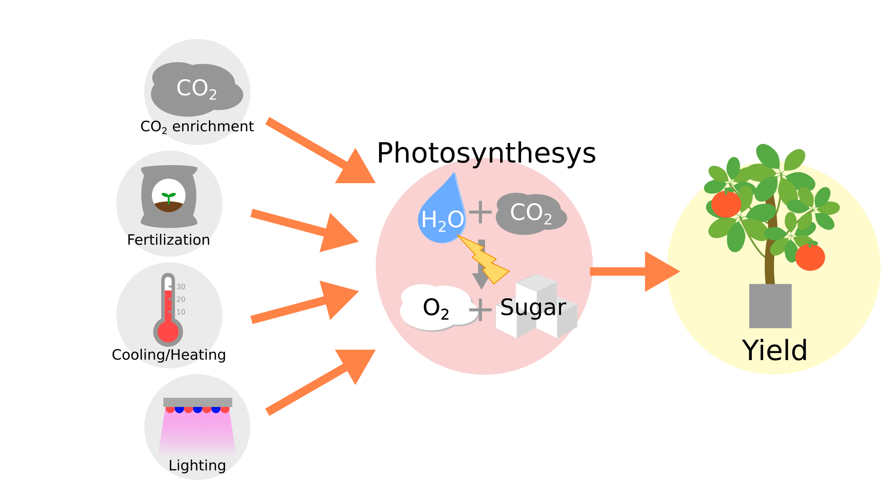 -->

Note:

In greenhouses, we can control various environment factors.
But their optimization is usually difficult.
One promising approach may be to assess photosynthesis because it is closely related to yield.
That is, adjust environment, assess photosynthesis, and adjust environment again to achieve higher yield.
So, evaluation of photosynthesis is essential for horticulture.
In the next slide I'll briefly overview the common methods.

<!-- +++?image=img/comparison3.png&size=cover -->
<!-- +++?image=img/comparison3.png&position=bottom 30px right 50%&size=80% auto -->
+++

 
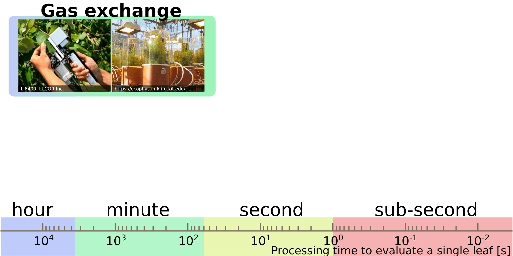

Note: 

Among several methods, the most common method is gas-exchange measurement, but this method is very slow, sometimes takes an-hour to evaluate a leaf.

<!-- +++?image=img/comparison2.png&size=cover -->

+++

 
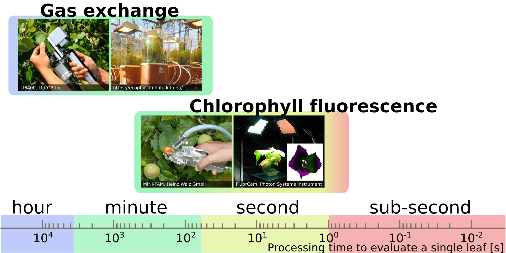

Note: 

Another common method is chlorophyll fluorescence measurement, usually known as PAM.
By using PAM devices, we can estimate quantum yield, or light-use efficiency of photosynthesis.
PAM measurement is very rapid takes several minutes.
Also, we can get spatial distribution.

Is it enought rapid?
I don't think so because we often want to evaluate hundreds of or thousands of leaves.
That is, we need more rapid method.

<!-- +++?image=img/comparison1.png&size=cover -->

+++

 
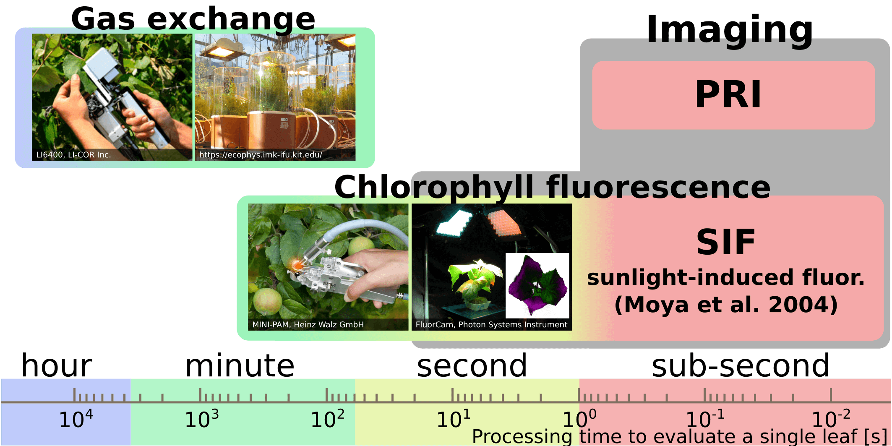

Note: 

Recently, some potentially rapid and effective methods based on imageing have been intensively tested.
And in this study, we focus on one of them called PRI.

+++
<!-- .slide: class="center" -->

### Outline

 
 

@ol

1. What's PRI?  
2. Expt. 1: short-term measurement  
3. Expt. 2: long-term measurement  
4. Summary  

@olend

Note:

Here is the outline of my presentation.
First, I will introduce the PRI.
Then, I will share with you two experimental results.
And finally summarise them.

---?color=linear-gradient(to left, #56ccf2, #2f80ed)
<!-- .slide: class="center" -->

### What's PRI?

+++

<u>P</u>hotochemical <u>R</u>eflectance <u>I</u>ndex <micro>(Gamon et al. 1992; Remote Sens Environ)</micro>

<ul>
<li>Index calculated from reflectances in two wavebands</li>
<li>Spatial PRI distribution is available by using cost-effective devices</li>
</ul>

<!--html_preserve-->
<!--/html_preserve-->

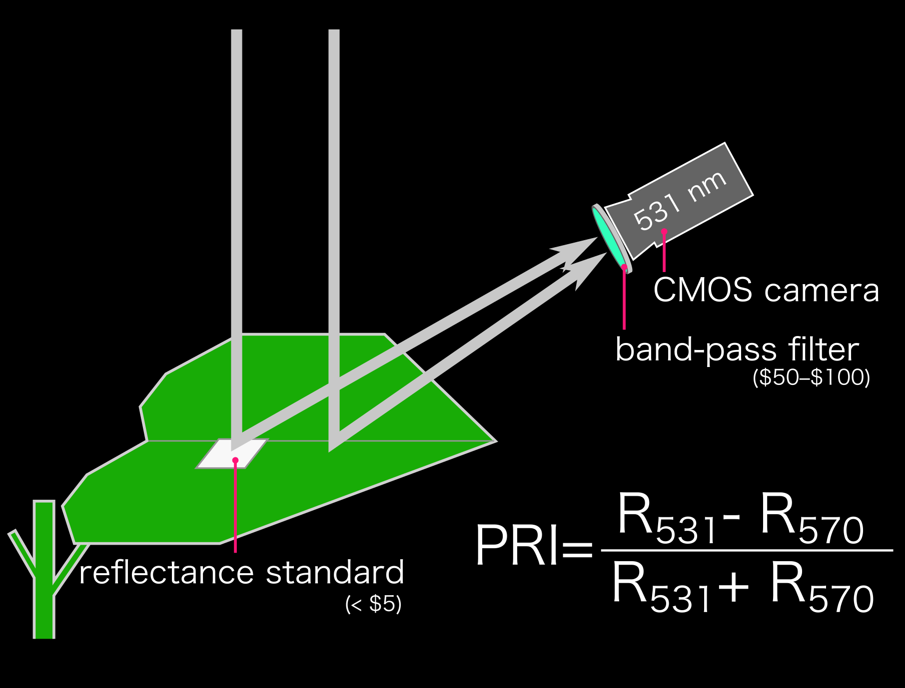

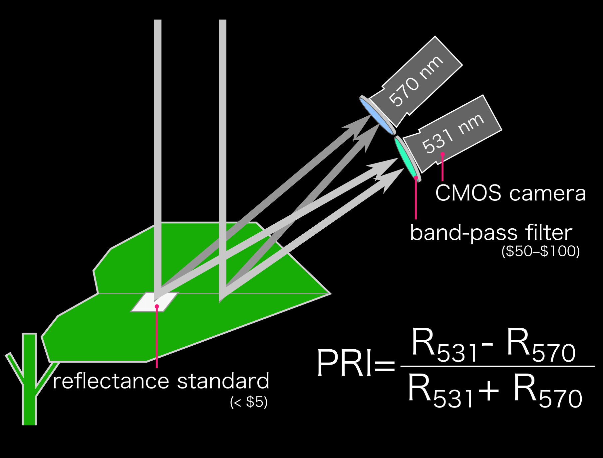

Note:

PRI, photochemical reflectance index, is an index calculated from leaf reflectances in two wavebands.
And we can measure spatial PRI values with cost-effective devices.
Measure reflectance at one waveband using a camera with a bandpass filter, and another band.

+++

<u>P</u>hotochemical <u>R</u>eflectance <u>I</u>ndex <micro>(Gamon et al. 1992; Remote Sens Environ)</micro>

@ul

- Indicator of heat-dissipation activity (i.e. the state of xantophyll cycle)
- Correlates with light-use efficiency (LUE := gross photosynthesis per photon)

@ulend

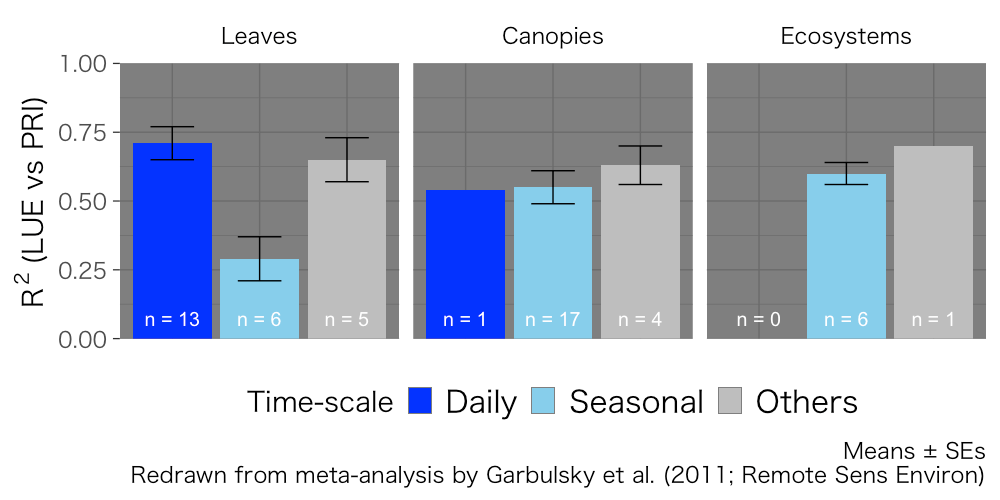

Note:

PRI reflects the heat-dissipation activity of photosynthesis.
And importantly, PRI is correlated with LUE defined as gross photosynthesis per photon.
Some meta-analysis reported substantial correlation between LUE and PRI in wide temporal and spatial scales.
Thus, PRI can be a good indicator of LUE.

+++

Objectives: What should we know?

Note:

What should we know about PRI?
We assessed two questions in this study

+++

Objectives: What should we know?

 

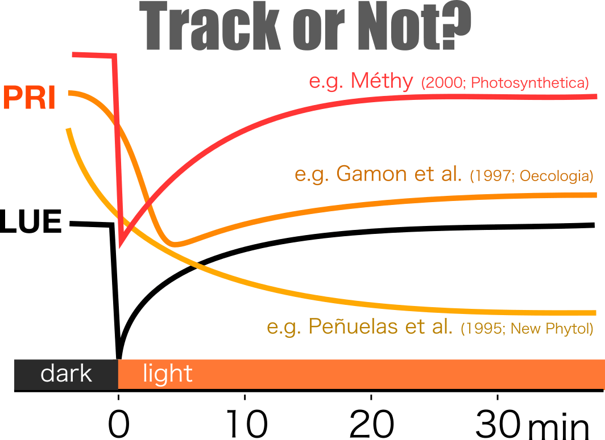
 **Minute–Hour**

Note:

The first question is ‘Does PRI track LUE or not?’.
During a transition from low-light to high-light, LUE, showin in black, shows rapid drop and gradual recovery.
Some researchers reported that PRI completely followed LUE, while others reported delayed drop-and-recovery or monotonic decrease.
Which is true? or What is the cause of the difference?
This is a question in timescales of minutes to an-hour

+++

Objectives: What should we know?

 

**Minute–Hour**

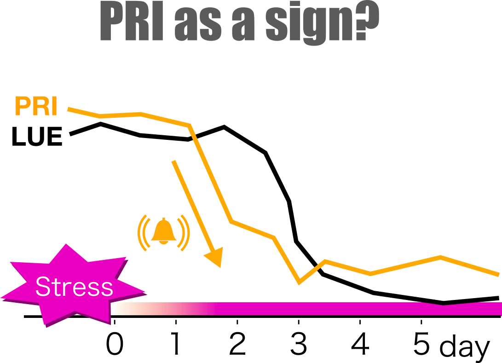
**Day–Week**

Note:

The second question is that ‘Does decrease in PRI work as a sign of decrease in LUE?’.
If the PRI decrease before the decrease in LUE in response to some stress, we can mitigate the impact of stress by controling environments based on PRI.
This is a question in timescales of days to a week

OK, Move on to the first experiment.

---?color=linear-gradient(to left, #56ccf2, #2f80ed)
<!-- .slide: class="center" -->

### Expt. 1: short-term measurement   Track or Not?

+++

**MATERIALS**

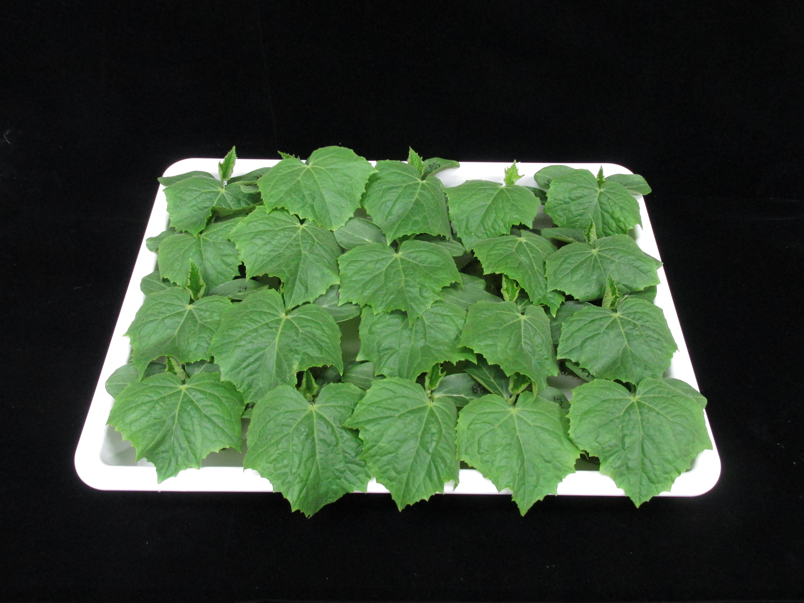

<small>• Cucumber seedlings</small> 
<small>&emsp;■ 2-week-old</small> 
<small>&emsp;■ grown under 300 µmol m-2 s-1</small>
    

**METHODS**

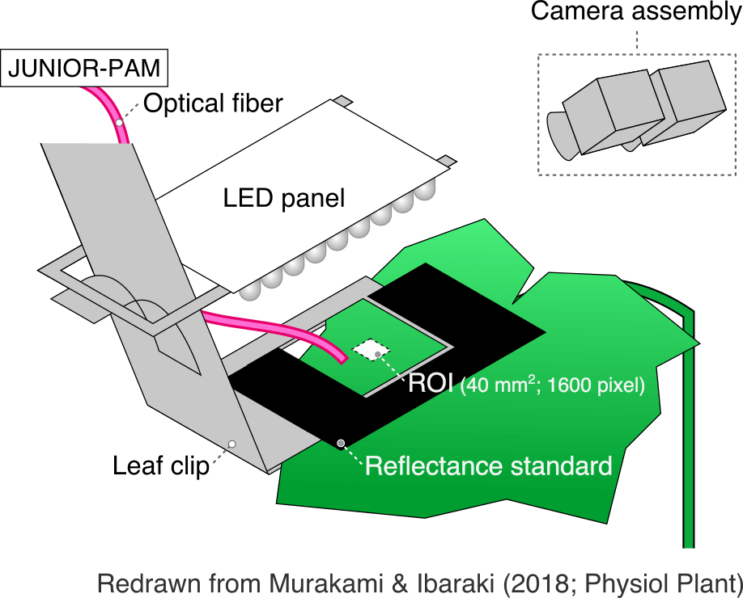

<small>• Traced PRI and YII after dark-light transition</small> 
<small>&emsp;■ YII (= ϕPSII) &prop; LUE <small>(e.g. Genty et al. 1989; BBA)</small></small>

Note: 

We cultivated cucumber plants.
We traced PRI and photosynthetic quantum yield of PSII, YII, which is proportional to LUE.
PRI of small region was monitored by two cameras with band-pass filters, and LUE was measured with PAM device.

---?color=linear-gradient(to left, #88ccf2, #aae7ed)

### Expt. 1: Results

+++?image=figure/single_pam-1.png&position=bottom 30px right 50%&size=55% auto
<!-- .slide: data-background-transition="none" -->

@ul
- <small>LUE dropped rapidly and then recovered gradually (i.e. Photosynthetic induction)</small>
- <small>The higher irradiance was, the smaller LUE was</small>
@ulend

Note:

This slide shows quantum yield of PSII, a measure of light-use efficency, after dark-light transitions.
Three independ experiments, time, efficiency.
The efficiency dropped rapidly after the irradiation, and then increased gradually.
This is typical photosynthetic induction.
And the yield was smaller under high light.

In the next slide, I'll show you the time course of PRI.

+++?image=figure/single_dpri-1.png&position=bottom 30px right 50%&size=55% auto
<!-- .slide: data-background-transition="none" -->

@ul
- <small>PRI response was slower than LUE response</small>
- <small>The higher irradiance was, the greater PRI changed</small>
@ulend

Note:

This is the time course of PRI, changes from the initial values.
Apparently, there was no rapid drop in PRI and the decrease was slower.
And the PRI is smaller under high-light. 

+++?image=figure/single_dpri-2.png&position=bottom 30px right 50%&size=55% auto
<!-- .slide: data-background-transition="none" -->
- <small>PRI response was slower than LUE response</small>
- <small>The higher irradiance was, the greater PRI changed</small>
- <small>Monotonic decay under high light</small>

Note: 
When look at the PRI under high-light, you can see that the decrase was monotonic.

+++?image=figure/single_dpri-3.png&position=bottom 30px right 50%&size=55% auto
<!-- .slide: data-background-transition="none" -->
- <small>PRI response was slower than LUE response</small>
- <small>The higher irradiance was, the greater PRI changed</small>
- <small>Monotonic decay under high light while <aqua>down-up under low light</aqua></small>

Note: 

On the other hand under low-light, there was some gradual recovery although not clear.

+++?image=figure/single_dpri-1.png&position=bottom 30px right 50%&size=55% auto
<!-- .slide: data-background-transition="none" -->
- <small>PRI response was slower than LUE response</small>
- <small>The higher irradiance was, the greater PRI changed</small>
- <small>Monotonic decay under high light while <aqua>down-up under low light</aqua></small>

<!--html_preserve-->
<!--/html_preserve-->
Track or Not? → Depends on irradiance, but PRI was alwayed delayed

Note: 

Accornding to these result, the tracking performance of PRI depends on the irradiance.
But it was alwayed delayed. The response of PRI was not so fast as LUE.
In the next slide, I'll look into the relationship between PRI and LUE.

+++

@ul
- <small>Steady-state ∆PRI was correlated with LUE  → estimate LUE = α * ∆PRI + β</small>
- <small>Under transient states, the equation was not valid due to the slow PRI response</small>
@ulend

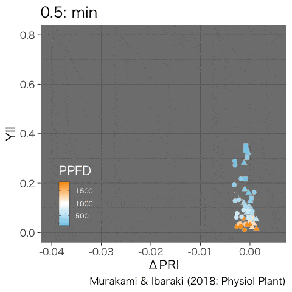
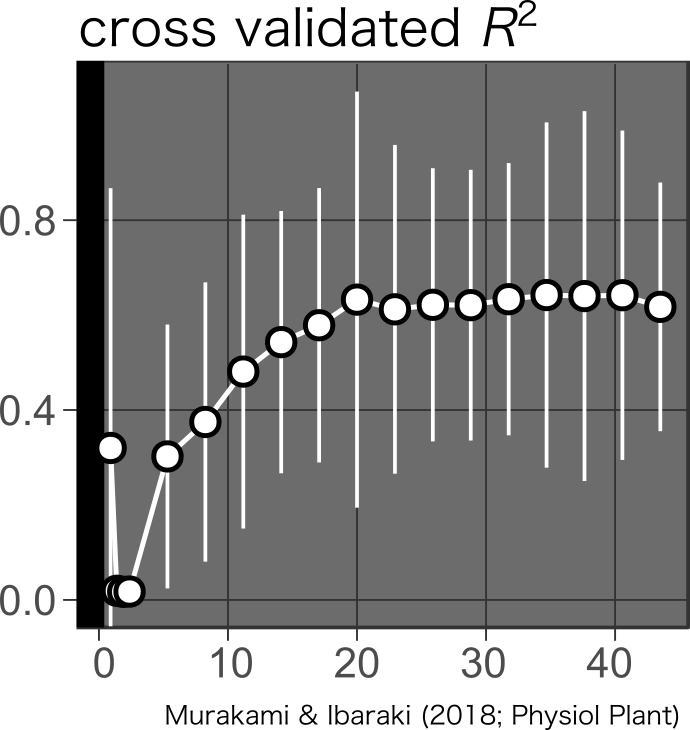

Note:

Left panel shows time-lapse scatter plot and right panel is the cross validated R-squared.
As you can see, the relationship between these parameters was linear and stable after about thirty minutes.
So we can estimate LUE from PRI under steady states.
However, the relationship is not valid under transient state because of the slow PRI response.
So we have to wait for a while to estimate light-use efficiency from PRI.

+++
<!-- .slide: class="center" -->

#### Expt. 1: Summary

 
 

@ul
- Does PRI track LUE or not? → Depends on irradiance
    - **Yes** under low-light, but it was delayed
    - **No** under high-light
- Is PRI a useful index to estimate LUE?
    - **Yes** under steady states
    - **No** under transient states
@ulend

Note:

Summary for first expeirment.
Track or Not? Depends on irradiance.
PRI tracked LUE under low-light but not under high-light.
PRI is a useful index to esimate LUE only under steady states.

I'll move on to the second experiment.

---?color=linear-gradient(to left, #56ccf2, #2f80ed)
<!-- .slide: class="center" -->

### Expt. 2: long-term measurement   PRI as a Sign?

+++

**MATERIALS**

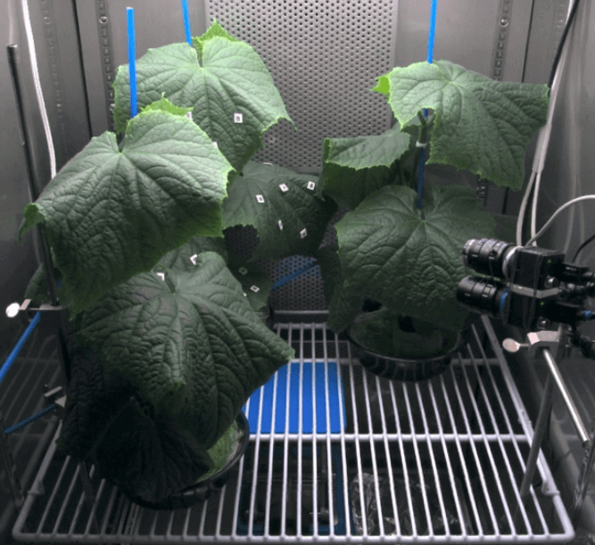

<small>• Cucumber “canopy”</small> 
<small>&emsp;• ca. 6-week-old</small> 

**METHODS**

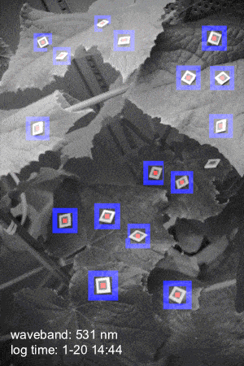

<small>Compared time courses during <orange>drought stress</orange></small>

<small>• PRI: <small>semi-automatic measurement by object tracking</small></small> 
<small>• YII (= ϕPSII) &prop; LUE <small>(e.g. Genty et al. 1989; BBA)</small></small>
<!-- <small>• Incident PPFD</small>  -->

Note:

In the second experiment, we cultivated small cucumber canopy and simultaneously evaluated several leaves.
PRI values of leaves around reflectance standard were evaluated by simple object-tracking program.
We measured LUE manually using a PAM device.
And we compared time courses of them during drought stress.

---?color=linear-gradient(to left, #88ccf2, #aae7ed)

### Expt. 2: Results

+++?image=figure/multi_y2_pri-1.png&position=bottom 30px right 50%&size=60% auto

Note:

Upper panel shows light-use efficiency and lower panel is PRI.
We stopped water supply for three days, and confirmed decrease in light-use efficiency due to the drought.
AS the PRI was noisy, so for simplicity, I'd like to show mean values of morning and afternoon.

+++?image=figure/multi_y2_pri-2.png&position=bottom 30px right 50%&size=60% auto
Note:
Although the PRI signals were not clear, we can see some decreases in PRIs.

+++?image=figure/multi_y2_pri-3.png&position=bottom 30px right 50%&size=60% auto

@ul
- <small>LUE decreased and then PRI decreased</small>
- <small>PRI-driven environmental control will not work</small>
@ulend

Note: 
However, LUE started to decrease around here before the decrease in PRI.
LUE decreased, and then PRI decreased.
Thus, PRI-driven environmental control will not work, at least under drought stress conditions.

+++

How to use PRI for environmental control?

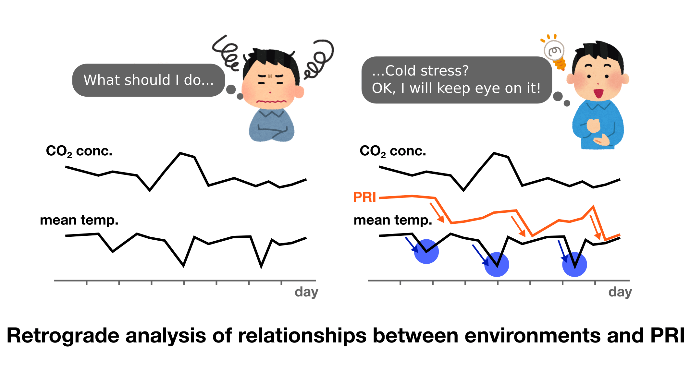

Note:

So, if we want to make use of PRI in environmental control, we should proceed in this way.
Local farmer usually measure some environemntal factors, but it is difficult to determine what to do.
If they also measure PRI, they can notice likely cause of PRI decrease, and find next step.
So namely retrograde analysis may be effective.

+++

#### Expt. 2: Summary

 
 

@ul
- **Does PRI work as a Sign?**
    - **No**. PRI decreased after decrease in LUE
- <!--html_preserve-->@fa[thumbs-down]<!--/html_preserve-->: PRI-driven environmental control
- <!--html_preserve-->@fa[thumbs-up]<!--/html_preserve-->: Retrograde analysis of relationship between PRI and environments
@ulend

Note:

Summary for the second exp.
PRI as a sign?, NO.
PRI decreased after decrease in LUE.
Thus, PRI-driven environment control may not be effective.
But, retrograde analysis may be effective.

---?color=linear-gradient(to left, #56ccf2, #2f80ed)
<!-- .slide: class="center" -->

### Summary

Note:

The final slide.

+++

@ul
- PRI imaging as an alternative for photosynhesis evaluation
    - <small>Rapid spatial evaluation with cost-effective devices</small>
- Track or Not? → Depends on irradiance
    - <small>Tracked under low-light with delay but not under high-light</small>
    - <small>PRI was useful to estimate LUE under steady states but not under transient states LUE</small>
- PRI as a Sign? → No, PRI decreased after decrease in LUE
    - <small>PRI-driven environmental control will not work</small>
    - <small>Retrograde analysis of PRI-environments relationship may be effective</small>

@ulend

<!--html_preserve-->
<!--/html_preserve-->
This work was supported by JSPS KAKENHI (Grant Number 17J04736 to K.M.) 
Contact: Keach Murakami (keach.murakami@gmail.com)

Note:
We tested validity of PRI imaging for evaluation of photosynthetic performance.
We can estimate spatial LUE with cost-effective devices.
Track performance depends on irradiance.
PRI tracked LUE only under low-light and was deleyed.
So, PRI was useful to estimate efficieny only under steady states.

---?color=linear-gradient(to left, #56ccf2, #2f80ed)

### Appendix

+++

 

Q.  
This method requires so many reflectance standards.
Is it practical?

 

A.  
May not be practical in open fields or large greenhouses.
But in compact and precisely controlled systems, it may work.
PRI may be a useful tools for research (e.g. phenotyping and screening) rather than for application.

+++?color=linear-gradient(to left, #88ccf2, #aae7ed)

Supporting information for Expt. I

+++

Why was PRI response slow compared with YII?

- PRI: **enzymatic** change in pigment composition of xanthophylls → **slow response**
- YII (LUE): **photochemical** change in redox poise of photosynthetic component → **fast response**

+++

**MATERIALS**

<small>• Cucumber seedlings</small> 
<small>&emsp;■ 2-week-old</small> 
<small>&emsp;■ grown under 300 µmol m-2 s-1</small>
    

**METHODS**

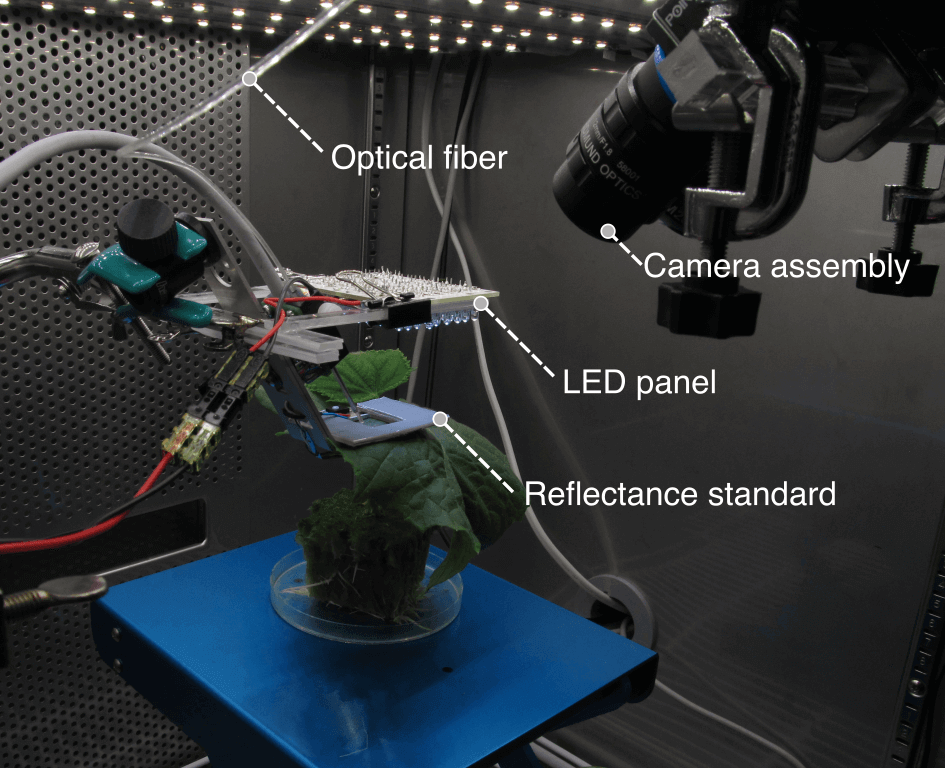

<small>• Traced PRI and YII after dark-light transition</small> 
<small>&emsp;■ YII (= ϕPSII) &prop; LUE <small>(e.g. Genty et al. 1989; BBA)</small></small>

+++?color=linear-gradient(to left, #88ccf2, #aae7ed)

Supporting information for Expt. II

+++?image=figure/multi_y2_ppfd-5.png&position=bottom 30px right 50%&size=50% auto

Time courses of irradiance and LUE.

+++?image=figure/multi_scat-2.png&position=bottom 30px right 50%&size=55% auto

Relationship between PRI and LUE.

<ul>
<li><small>Drought stress degraded the relationship (shown in red markers)?</small></li>
<li><small>Outliers → need corrections by leaf color or other reflectance index (e.g. NVDI)?</small></li>
</ul>

